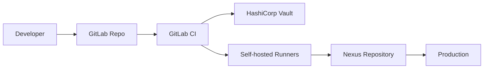

# Домашнее задание к занятию «Микросервисы: подходы»

Вы работаете в крупной компании, которая строит систему на основе микросервисной архитектуры.
Вам как DevOps-специалисту необходимо выдвинуть предложение по организации инфраструктуры для разработки и эксплуатации.


## Задача 1: Обеспечить разработку

Предложите решение для обеспечения процесса разработки: хранение исходного кода, непрерывная интеграция и непрерывная поставка. 
Решение может состоять из одного или нескольких программных продуктов и должно описывать способы и принципы их взаимодействия.

Решение должно соответствовать следующим требованиям:
- облачная система;
- система контроля версий Git;
- репозиторий на каждый сервис;
- запуск сборки по событию из системы контроля версий;
- запуск сборки по кнопке с указанием параметров;
- возможность привязать настройки к каждой сборке;
- возможность создания шаблонов для различных конфигураций сборок;
- возможность безопасного хранения секретных данных (пароли, ключи доступа);
- несколько конфигураций для сборки из одного репозитория;
- кастомные шаги при сборке;
- собственные докер-образы для сборки проектов;
- возможность развернуть агентов сборки на собственных серверах;
- возможность параллельного запуска нескольких сборок;
- возможность параллельного запуска тестов.

Обоснуйте свой выбор.

### Решение для CI/CD процесса разработки

#### Стек технологий

##### 1. **GitLab** - Система контроля версий и CI/CD
- Git репозитории для каждого сервиса
- Встроенный CI/CD (GitLab CI)
- Container Registry для Docker образов
- Webhooks и триггеры сборок

##### 2. **HashiCorp Vault** - Управление секретами
- Безопасное хранение паролей, ключей доступа
- Динамические секреты
- Интеграция с GitLab через JWT auth

##### 3. **Sonatype Nexus** - Репозиторий артефактов
- Хранение Docker образов
- Проксирование внешних репозиториев
- Версионирование артефактов
- Поддержка múltiples форматов (npm, Maven, Docker)

##### 4. **Self-hosted GitLab Runners** - Агенты сборки
- Развертывание на собственных серверах
- Параллельный запуск сборок
- Кастомные Docker образы для сборки

#### Архитектура взаимодействия



#### Реализация требований

| Требование | Реализация |
|------------|------------|
| Облачная система | GitLab.com или self-hosted |
| Git репозитории | GitLab (по репозиторию на сервис) |
| Сборка по событию | GitLab CI webhooks |
| Сборка по кнопке | GitLab CI manual triggers |
| Настройки на сборку | CI/CD variables + HashiCorp Vault |
| Шаблоны сборок | `.gitlab-ci.yml` templates |
| Секретные данные | HashiCorp Vault + GitLab protected vars |
| Несколько конфигураций | Multiple jobs в pipeline |
| Кастомные шаги | Custom scripts в CI jobs |
| Собственные Docker образы | GitLab Container Registry |
| Свои агенты сборки | Self-hosted GitLab Runners |
| Параллельные сборки | Parallel stages/jobs |
| Параллельные тесты | Parallel test jobs |

### Преимущества решения

- **Единая платформа** - Git + CI/CD в GitLab
- **Enterprise безопасность** - HashiCorp Vault для секретов
- **Универсальность** - Nexus Repository для всех артефактов
- **Гибкость** - Self-hosted runners под свой стек
- **Масштабируемость** - Параллельные pipeline


## Задача 2: Логи

Предложите решение для обеспечения сбора и анализа логов сервисов в микросервисной архитектуре.
Решение может состоять из одного или нескольких программных продуктов и должно описывать способы и принципы их взаимодействия.

Решение должно соответствовать следующим требованиям:
- сбор логов в центральное хранилище со всех хостов, обслуживающих систему;
- минимальные требования к приложениям, сбор логов из stdout;
- гарантированная доставка логов до центрального хранилища;
- обеспечение поиска и фильтрации по записям логов;
- обеспечение пользовательского интерфейса с возможностью предоставления доступа разработчикам для поиска по записям логов;
- возможность дать ссылку на сохранённый поиск по записям логов.

Обоснуйте свой выбор.

### Стек ELK + Vector + Docker

**Компоненты:**
1. **Vector** - сбор и обработка логов
2. **Elasticsearch** - хранение и поиск логов
3. **Kibana** - UI для анализа логов
4. **Docker** - источник логов (stdout)

### Архитектура
```
[Микросервисы] → [Docker stdout] → [Vector] → [Elasticsearch] ← [Kibana UI]
```


### Реализация требований

| Требование | Реализация |
|------------|------------|
| Центральный сбор со всех хостов | Vector агенты на каждом хосте |
| Минимальные требования к приложениям | Сбор из Docker stdout |
| Гарантированная доставка | Vector с persisted buffers |
| Поиск и фильтрация | Elasticsearch индексы + Kibana Discover |
| Пользовательский интерфейс | Kibana с ролевым доступом |
| Ссылки на сохранённый поиск | Kibana saved searches + sharing links |

### Обоснование выбора

- **Vector вместо Logstash/Filebeat** - выше производительность, built-in гарантии доставки
- **Elasticsearch** - промышленный стандарт для логов, полнотекстовый поиск
- **Kibana** - мощный UI с saved searches, sharing, dashboards
- **Docker stdout** - нулевая настройка приложений, стандартный подход

### Плюсы решения
- Production-ready стек
- Масштабируемость Elasticsearch
- Гибкость Vector pipelines
- Разделение доступа в Kibana
- Стандартные интеграции

## Задача 3: Мониторинг

Предложите решение для обеспечения сбора и анализа состояния хостов и сервисов в микросервисной архитектуре.
Решение может состоять из одного или нескольких программных продуктов и должно описывать способы и принципы их взаимодействия.

Решение должно соответствовать следующим требованиям:
- сбор метрик со всех хостов, обслуживающих систему;
- сбор метрик состояния ресурсов хостов: CPU, RAM, HDD, Network;
- сбор метрик потребляемых ресурсов для каждого сервиса: CPU, RAM, HDD, Network;
- сбор метрик, специфичных для каждого сервиса;
- пользовательский интерфейс с возможностью делать запросы и агрегировать информацию;
- пользовательский интерфейс с возможностью настраивать различные панели для отслеживания состояния системы.

Обоснуйте свой выбор.

## Задача 4: Логи * (необязательная)

Продолжить работу по задаче API Gateway: сервисы, используемые в задаче, пишут логи в stdout. 

Добавить в систему сервисы для сбора логов Vector + ElasticSearch + Kibana со всех сервисов, обеспечивающих работу API.

### Результат выполнения: 

docker compose файл, запустив который можно перейти по адресу http://localhost:8081, по которому доступна Kibana.
Логин в Kibana должен быть admin, пароль qwerty123456.


## Задача 5: Мониторинг * (необязательная)

Продолжить работу по задаче API Gateway: сервисы, используемые в задаче, предоставляют набор метрик в формате prometheus:

- сервис security по адресу /metrics,
- сервис uploader по адресу /metrics,
- сервис storage (minio) по адресу /minio/v2/metrics/cluster.

Добавить в систему сервисы для сбора метрик (Prometheus и Grafana) со всех сервисов, обеспечивающих работу API.
Построить в Graphana dashboard, показывающий распределение запросов по сервисам.

### Результат выполнения: 

docker compose файл, запустив который можно перейти по адресу http://localhost:8081, по которому доступна Grafana с настроенным Dashboard.
Логин в Grafana должен быть admin, пароль qwerty123456.

---

### Как оформить ДЗ?

Выполненное домашнее задание пришлите ссылкой на .md-файл в вашем репозитории.

---
